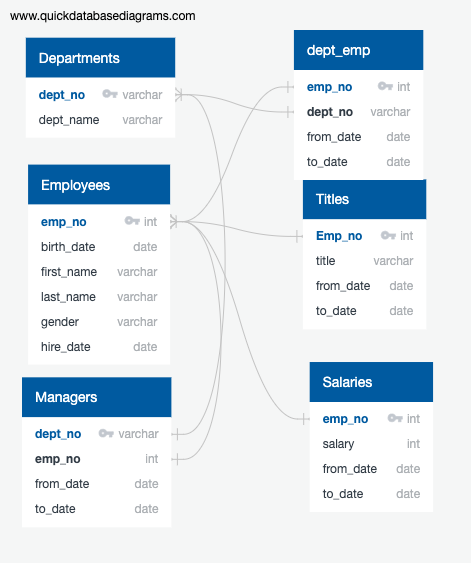

# Pewett Hackard Retirement Analysis (Challenge 7)
For the new modifications to the PlanMyTrip app, you are asked to add more data to the database, or cities DataFrame, so that customers know the weather in the cities when they click on a pop-up marker. You’ll also need to add the amount of rainfall or snowfall within the last three hours so that customers can filter the DataFrame using input statements based on the temperature range and whether or not it is raining or snowing. Finally, you’ll need to create a directions layer Google map that shows the directions between multiple cities for travel.

## Resources
- CSV: titles.csv, salaries.csv, employees.csv, dept_manager.csv, dept_emp.csv, departments.csv
- Software: PostgreSQL 11.7, pgAdmin 4, QuickDBD

## Output
- schema.sql, and challenge.sql located in /Queries folder
- CSV input and output located in /Data folder

## ERD
## Entity Relationship Diagram

Using QUickDBD, I desgined a flowchart to show how the current flat employee data provided by the client can be integrated into a Database. The given CSV files had one main key field that was shared across most of the documents. Emp_no (Employee number) is a unique identifier that will be unique to each employee. In adition, Dept_no (Department number) is a unique identifier that corresponds to the departments within the company. Using these two keys, we are able to design a relational database with the following ERD

## Part 1
## Who could be retiring soon (based on age of employee)

Based on employees born btween 1952, and 1955 who are currently employeed: There are 33,118 employees who are nearing retirement. The majority of those who could be retiring will be coming from the Senior Engineer position; The breakdown of titles is below:

| Title | Count | % of Retirement Group |
|---|---|---|
| Senior Engineer | 13,651 | 41.22% |
| Senior Staff | 12,872 | 38.87% |
| Engineer | 2,711 | 8.19% |
| Staff	| 2,022 | 6.11% |
| Technique Leader	| 1,609 | 4.86% |
| Assistant Engineer| 	251 | 0.76% |
| Manager| 	2 | 0.01% |

The full output of employees who could be reiring soon is here: [Retiring Employees](Data/Challenge_Retiring_employees_recent_titles.csv)

## Candidates for a Mentor

The criteria for being eligable for a mentor is someone currently employeed who was born in 1965. Based on this, there are 1549 employees who qualify for a mentor. The percentage breakdown of this list follows closely with the percentage breakdown of employees ready to retire, with Senior Engineers making the majority of eligable Mentees.

| Title | Count | % of Retirement Group |
|---|---|---|
| Senior Engineer |	529 |	34.15% |
| Senior Staff |	569 |	36.73% |
| Engineer |	190 |	12.27% |
| Staff |	155 |	10.01% |
| Technique Leader |	77 |	4.97% |
| Assistant Engineer	| 29 |	1.87% |
| Manager	| 0 |	0.00% |

This means that there is a high possibity that there will be candidates ready to take some of the key positions should they be vacated by retirement. While this list of mentees only makes up about 4.68% of the amount of retirees, opening up the criteria to different age groups could help fill in any gaps and keep key positions from being vacant.

The list of eligable mentees is here: [Eligable for Mentor](Data/Challenge_Mentee_list.csv)

# Technical Report
## queries

After importing all of the CSV files into SQL tables, The criteria for employees eligable for retirement was as follows:

1) Currently employeed at the company
2) Hired between 1985 and 1988
3) Born between 1952 and 1955

This would mean employees aged 65 - 68 who have worked for the company for 32 - 35 years

In order to pull this data, ir requires linking four tables;
Employees, Salaries, Titles, and Employee Departments;

The query is as follows:

SELECT e.emp_no,  
e.first_name,  
e.last_name,  
ti.title,  
ti.from_date,  
s.salary  
INTO c_retire_emp_info  
FROM employees as e  
INNER JOIN salaries AS s  
ON (e.emp_no = s.emp_no)  
INNER JOIN titles AS ti  
ON (e.emp_no = ti.emp_no)  
INNER JOIN dept_emp as de  
ON (e.emp_no = de.emp_no)  
WHERE (e.birth_date BETWEEN '1952-01-01' AND '1955-12-31')  
     AND (e.hire_date BETWEEN '1985-01-01' AND '1988-12-31')  
	 AND (de.to_date = '9999-01-01');  
   

This allowed me to pull all retirement eligable employees and their title(s) into a new table. 

A similar query was used to determine any employee who is eligable to be mentored: The qualifications for that are,

1) Curently employeed at the company
2) Born in 1965

This criteris was much simpler, but the overall query was the same:

--Employees Ready for Mentors. 
SELECT e.emp_no,  
e.first_name,  
e.last_name,  
ti.title,  
ti.from_date,  
de.to_date  
INTO c_mentor_emp_info   
FROM employees as e   
INNER JOIN salaries AS s   
ON (e.emp_no = s.emp_no)   
INNER JOIN titles AS ti   
ON (e.emp_no = ti.emp_no)   
INNER JOIN dept_emp as de   
ON (e.emp_no = de.emp_no)   
WHERE (e.birth_date BETWEEN '1965-01-01' AND '1965-12-31')   
	 AND (de.to_date = '9999-01-01');   

After obtaining both lists of candidates, They needed to be sorted out and extra titles had to be removed; Since employees can cange titles during their tenure at the company, we only need to know their current title. This cleaned up the lists, and allowed a usable output.

All of the queries created and used are here: [Challenge Queries](Queries/Challenge.sql)

The Schema used to create the tables are here: [Table Creation Schema](Queries/schema.sql)

